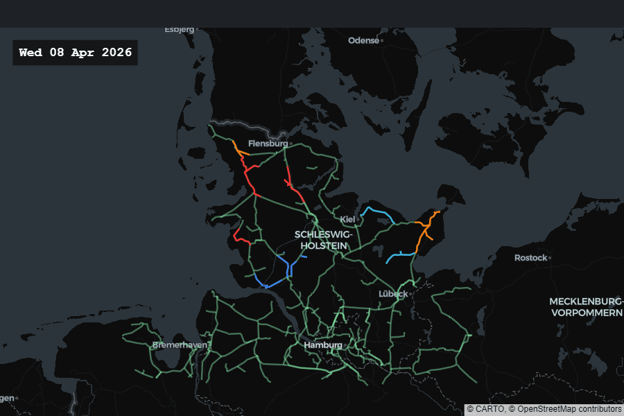

# Redispatch in Schleswig-Holstein

> Where, when, and **why** the SHN grid has had to step in.
> A live dashboard over Schleswig-Holstein's 110 kV distribution network.



*30 daily frames — green lines stay calm, blue/orange/red lines mean
substations along that line ordered redispatch that day. The cluster on
the windy North Sea coast (Husum, Heide, Reußenköge) is where Germany's
generation surplus runs into a 110 kV bottleneck.*

---

## What's a redispatch event, in plain English?

Wind farms in the north generate power faster than the local 110 kV
lines can move it south. When that surplus would overload a line, the
operator phones a wind farm and says **"please reduce output for the
next two hours."** That phone call is one redispatch event.

Each event has a cost (the wind farm gets paid for the lost generation
out of grid fees, which feed back into your electricity bill), so a
network with lots of redispatch is one that needs reinforcement —
either bigger lines, or more storage, or more flexible demand.

This dashboard answers three questions:

1. **Today** — which substations had redispatch and how busy were they?
2. **Why?** — which grid conditions tilted the day toward stress?
3. **By town** — how is one substation trending over the past 90 days?

---

## Run it

```bash
pip install -r requirements.txt
streamlit run app.py
```

Open <http://localhost:8501>. The dashboard ships with everything it
needs to render historical attribution, including a daily-refresh
summary committed to the repo. No API keys required.

If you've cloned fresh and want a full local rebuild (or to score a
specific date):

```bash
python src/build_timeseries.py            # 15-min activity matrix
python src/v2/build_features.py           # ML feature table
python src/v2/score_today.py --date 2026-04-15  # one day's prediction + attribution
```

---

## Tour

### Tab 1 — *Today*

Pick a date. The map shows every 110 kV line in Schleswig-Holstein,
coloured by the highest concurrent-op count among nearby substations:

| Colour | Meaning |
|---|---|
| 🟢 light green | no activity |
| 🔵 cyan | 1-3 concurrent ops |
| 🟦 blue | 4-9 |
| 🟧 orange | 10-19 |
| 🟥 red | 20+ (critical) |

Above the map: a one-line headline ("It was a busy day · top 12 % of
days in 2024–25") and a KPI strip.

Below the map, the **Why?** panel — the part that's actually new:

```
Why did today look this way?

256 town-hours of redispatch today — about 1.9× a typical day (135).
Below, the model attributes the elevated stress to today's grid
conditions.

  Wind                +29.8 %  ████████████  (a lot)
  Recent activity      +7.8 %  ███           (a little)
  Calendar             +4.4 %  ██
  Load & price         +1.0 %  ░
  Solar & temperature  -1.8 %  ░
  Location             -0.5 %  ░
                       ←  made today calmer  ·  busier  →
```

Two further drill-downs in expanders:
- *What does each driver mean?* — plain-English explanation of why each
  family matters in SHN (windy days clog the export lines, etc.).
- *See the numbers* — top-5 individual signals as TreeSHAP log-odds for
  the technically-curious reader.

### Tab 1 — *Recent days animation* and *Custom window animation*

Same map, but moving. Pick a preset (last 3 / 7 / 14 / 30 / 90 days)
or a custom range with explicit hourly/daily granularity. Drag the
slider, press play, watch the grid heat and cool.

### Tab 2 — *By town*

Pick a substation, get:
- 90-day daily-active-hours bar chart with a 7-day rolling average
- 7-day × 24-hour heatmap (was that 3am Tuesday active?)
- KPI strip: total active hours, days with redispatch, busiest day, %
  of time congested
- Substation-level breakdown — which transformer inside the town
  actually got curtailed

---

## How "Why?" works

The dashboard ships with three calibrated **LightGBM** models, one per
forecast horizon (1h, 6h, 24h-ahead). The 24h model is the one whose
output drives the Why? panel — it predicts the probability that any
given (hour × substation) cell will see redispatch in the next 24
hours.

Performance on the held-out test slice (Jan – Mar 2026):

| Horizon | ROC-AUC | PR-AUC | Brier |
|---|---|---|---|
| 1h | 0.86 | 0.23 | 0.038 |
| 6h | 0.86 | 0.33 | 0.052 |
| 24h | 0.83 | 0.44 | 0.089 |

For each day, **TreeSHAP** decomposes every per-cell prediction into
per-feature contributions. We aggregate the 198 features into six
operator-friendly families:

- **Recent activity** — has the grid been busy in the last 24h / 7d?
- **Wind** — onshore, offshore, hub-height speed, gusts, direction
- **Solar & temperature** — solar generation, irradiance, cloud cover
- **Load & price** — total demand, residual load, day-ahead price
- **Calendar** — hour, day-of-week, season, holiday
- **Location** — per-town identity priors, lat/lon

The bars on the Why? panel are these six families' average per-cell
log-odds contribution for the day, expressed as an odds-ratio change
(`exp(logodds) - 1`).

---

## How the dashboard stays fresh

A GitHub Actions cron runs once a day at **04:30 UTC**:

1. Pull new SHN ops from the public Connect+ API
2. Refresh the SMARD market + Open-Meteo weather caches
3. Rebuild the 15-min activity matrix
4. Rebuild the ML feature table
5. Score the most recent fully-coverable date
6. Append today's attribution to the rolled-up summary parquet
7. Commit + push the small artifacts; Streamlit Cloud picks up the
   redeploy automatically

Per-day TreeSHAP parquets stay on the runner (~600 KB × 800+ days =
half a gigabyte). Only the rolled-up daily-summary file (~50 KB total
for the entire history) ships in git.

---

## Repo layout

```
.
├── app.py                              Streamlit dashboard
├── docs/
│   └── animation_30d.gif               the GIF at the top of this README
│
├── src/
│   ├── build_timeseries.py             SHN ops chunks → 15-min activity matrix
│   ├── build_daily_summary.py          per-day contribs → rolled-up summary
│   ├── driver_attribution.py           TreeSHAP grouping + decomposition (pure)
│   ├── fetcher.py                      incremental SMARD + weather cache
│   ├── grid_topology.py                OSM Overpass → 110 kV GeoJSON
│   ├── smard_client.py, weather_client.py, fetch_shn_ops.py
│   ├── theme.py                        dark Operator palette + Plotly template
│   │
│   └── v2/                             ML pipeline (production)
│       ├── build_features.py           hourly features for training + scoring
│       ├── train.py                    three calibrated LightGBM models
│       ├── score_today.py              writes predictions + TreeSHAP per day
│       └── predict.py, review_model.py, labels.py
│
├── models/                             trained boosters + isotonic calibrators
├── tools/render_animation_gif.py       this README's GIF generator
│
├── data/                               (mostly gitignored, regenerable)
│   ├── raw/shn_operations_last_2y/     daily SHN ops chunks (committed)
│   ├── external/                       SMARD/weather cache, towns_geo, grid topology
│   ├── processed/                      ts_15min_*.parquet, features.parquet
│   └── predictions/contributions_daily_summary.parquet  (committed; ~50 KB)
│
└── .github/workflows/refresh-data.yml  the daily cron above
```

---

## Limitations

- **SHN only.** Coverage ends at the Schleswig-Holstein state border;
  southern German DSOs aren't in scope.
- **Town-centroid geocoding.** Many private 110 kV substations don't
  publish exact coordinates; we approximate from the parent town.
- **24-48h trailing edge.** The forecast feature pipeline trims a 24h
  cooldown so labels are valid; SMARD/weather have their own ~24h
  publication lag. The dashboard always trails real-time.
- **Single weather location.** Berlin weather is used as a national
  proxy. Good for temperature, weaker for the wind-heavy north coast.
- **Forecast vintages, not actuals.** The model trains on historical
  *actuals* of SMARD/weather. A v1.5 to-do is to use day-ahead forecast
  vintages so train/serve skew goes to zero.

---

## Reproducibility

Everything is deterministic given:

- The raw SHN ops chunks under `data/raw/shn_operations_last_2y/`
- The committed SMARD/weather cache under `data/external/`
- The committed model artifacts under `models/`

A full local rebuild from raw to scored predictions takes ~5 minutes on
a 16 GB laptop. The animation GIF in this README is regenerated by
`python tools/render_animation_gif.py`.

---

## Data sources

- **SHN ops** — Schleswig-Holstein Netz Connect+ API (public, daily refresh)
- **SMARD market data** — [smard.de](https://www.smard.de) (regulator-published, hourly)
- **Weather** — [Open-Meteo Historical Weather API](https://open-meteo.com) (ERA5 reanalysis, ~9 km grid)
- **Grid topology** — OpenStreetMap via [Overpass API](https://overpass-api.de) (110 kV substations + lines, refreshed monthly)
